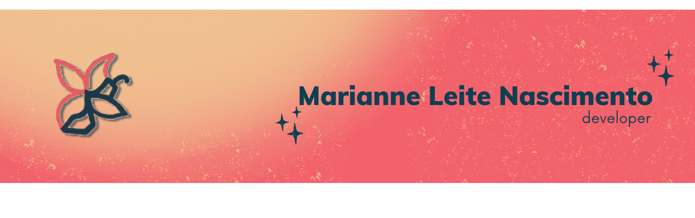

# Marianne-Leite-Nascimento
*Desenvolvedora Flutter multiplataforma | UX/UI Desing | Iot | cloud computing | Dart & Flutter |*

## *Sobre mim:*

Sou uma desenvolvedora Flutter focada em criar apps intuitivos, bonitos e conectados. Tenho explorado áreas como IoT, computação em nuvem e UX/UI design, buscando ampliar meus conhecimentos e trazer soluções cada vez mais completas. Acredito no poder da tecnologia bem pensada para facilitar a vida das pessoas e estou sempre em evolução.

#### [Confira meu portfólio](https://github.com/MarianneLeiteNascimento/portfolio/edit/main/README.md)

## *About me:*

*Cross-plataform Flutter Developer | UX/UI Desing | Iot | cloud computing | Dart & Flutter |*

I'm a Flutter developer focused on creating intuitive, beautiful, and connected apps. I've been exploring areas like IoT, cloud computing, and UX/UI design to expand my knowledge and deliver increasingly complete solutions. I believe in the power of well-thought-out technology to make people's lives easier, and I'm always evolving.

####  [View my portfolio](https://github.com/MarianneLeiteNascimento/portfolio/edit/main/README.md)
